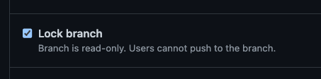
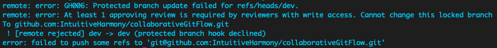

# COLLABORATIVE GIT FLOW

There are many aspects of group work. This lesson will focus specifically  on using git and gitHub as a collaborative tool.

> <br>Git - Open source version-control system <br>GitHub - Platform for hosting and collaborating on Git repositories <br><br>*Definitions from [GitHub Cheatsheet](https://training.github.com/downloads/github-git-cheat-sheet.pdf "GitHub Cheatsheet")*

Git is the program that is used locally in your terminal for version control. In order to achevie this it uses `branches` and a process called `merging`.  GitHub mirrors a lot of the functionality of git, it also has the ability to branch and merge.  I think of git being a tool on my local machine used for version control and gitHub being like facebook for my code.  

<br>

## GET ORGANIZED

A little planning goes a long way!  Before initializing a repo or writing any code it is beneficial to come together as a group and establish a few things:

- Determine who likes to work on which aspects of the code.  Some of us are more front end oriented some are more back end.  One of the benefits of working in a group is leaning on eachothers' skills AND learning from eachother.  Each person in the group should have a high level understanding of what each member is doing with their code even though they may not be working on that specific part.

- Agree upon a basic file structure.  As we code more and more projects we may find ourselves repeating a lot of the same tasks or setup.  This is another thing to lean into.  From the cullinary world there is an idea called *mise en place* which essentially means *putting everything in it's place*.  When we are consistant about how we set things up from project to project it will help us build muscle memory and allow us to focus on the project itself.  The opposite of this may bee seen as re-inventing the wheel each time  

- Determine who will initilize the repo.  While each person will eventually be a collaborator, one group member will set up the initial repo and then make others collaborators.  Each team member will clone the project to their local machine.

<br>

## SET UP THE REPO

One person in the group should take care of this part

<br>

### INITIALIZE 

Navigate to your gitHub account online.  In the top right hand corner there is a `+` button.  This will open a drop down menu, select new repository.


Fill out the form to create a new repo:
- Name
- Description of the repo (optional but reccomended)
- Add README (for sure!)
- Add .gitignore based on your project template (if available)

Click the green `Create repository` button

<br>

### INVITE COLLABORATORS

1. Open the settings page by clicking `Settings` tab.  
2. Click on the first submenu under `Access` which is `Collaborators`.  
3. Within this page there is an `Add people` button.  Use this to invite your group members

<br>


<br>

Find your team mates using their gitHub handles or email addresses.  Select each person and click the green button to send them an invite.


<br>

This will send and invite to each of the group member's email addresses.  As a collaborator make sure you accept the invite or the owner of the repo will see something like this, until you do.


<br>

### CLONE

At this point only the person setting up should clone the repo in order to set up the dev branch.  

In the terminal clone down the repo to your local machine:

*note: the address below is for the `collaborativeGitFLow` repo.  Your group's address will be different*

```
git clone git@github.com:IntuitiveHarmony/collaborativeGitFlow.git
```

<br>

### CREATE A DEV BRANCH

This is the "staging" branch to test out new features on.  This will be a copy of the main branch and it is where we will pull in our code from feature branches to make sure it merges properly with what we already have on the main branch and what other people have been working on inside their feature branches.  

Run this command in the terminal:

```
git checkout -b dev
```

The `checkout` command allows us to switch between branches.  The `-b dev` creates a new branch called `dev`, makes a copy of the branch you are on and  switches to `dev`.

Inorder to see the all the branches in a repo run in the terminal:

```
git branch
```

The asterisk tells us which branch we are currently on.  If you have oh my zish installed you may have another sort indicator of the current branch, notice the `dev` in pink on the command line.  This is useful to visually not only see which branch you are on, but that you are in a git repo.  


Once this branch has been made locally, push it to gitHub.  In the terminal run:

```
git push origin dev
```

This will push the `dev` branch to gitHub.  Navigate to gitHub, REFRESH the page and you shoud see the new branch in the dropdown menu on the left side of the page.


<br>

### ADD BRANCH PROTECTIONS

This step is not necessary, but it is highly reccomendded inorder to protect all your group's hard work.  This is a way to add another layer of protection for your valuable main branch. Essentially we are going to make it so any one of the collaborators cannot just edit the code on the main (or any other protected) branch 

Back in the: 
1. Settings page 
2. Navigate to the `branches` sub menu under `Code and automation`
3. Click the `Add branch protection rule` button


<br>

This is the page where we can add rules to help protect our branches.  The ones that we are going to implement is `Require a pull request before merging` clicking this will open another menu. `Require approvals` should already be checked.  We can increase the number of approvals if we want but one should be enough for our pourposes.  

Towards the end of the page select the radio buttons labeled `Lock branch` and `Do not allow bypassing the above settings`.  

Do this for both the `main` and `dev` branch. 


...



<br>

Essentially the `Require approvals` puts a restriction within gitHub that requires someone from your team to review code before it is merged with any protected branch. 

The `lock` doesn't allow any one to push changes to any protected branch from their local machine.  *i.e. `git push origin main` no longer works* 

The `Do not allow bypassing` make the rules we just put in place to apply to everyone collaborating on the repo.

If we try to push to `main` or `dev` we will get the following error:



When this is complete we should have something that looks like this:


<br>
<hr>

## PULL REQUESTS


